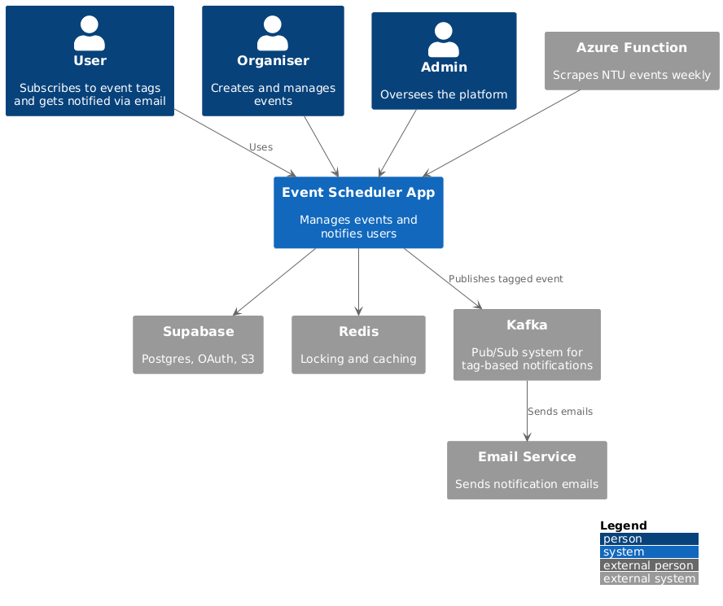
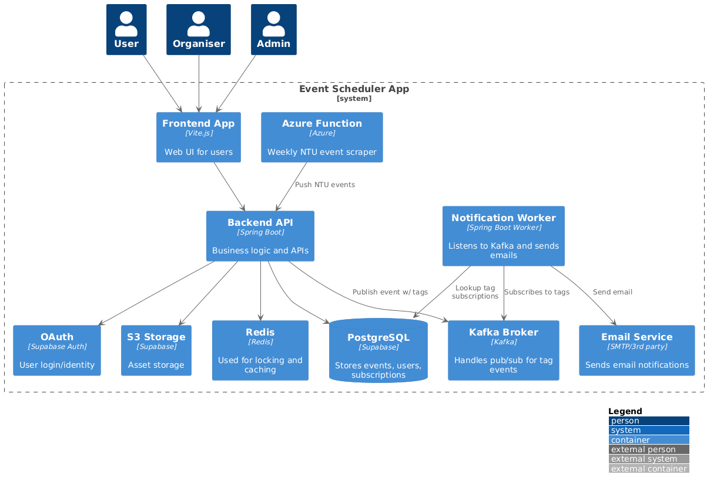
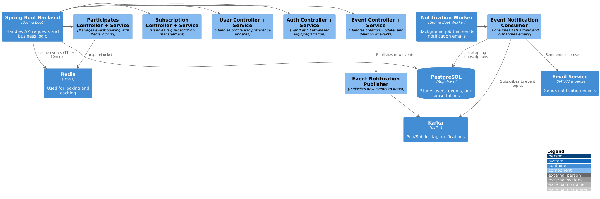
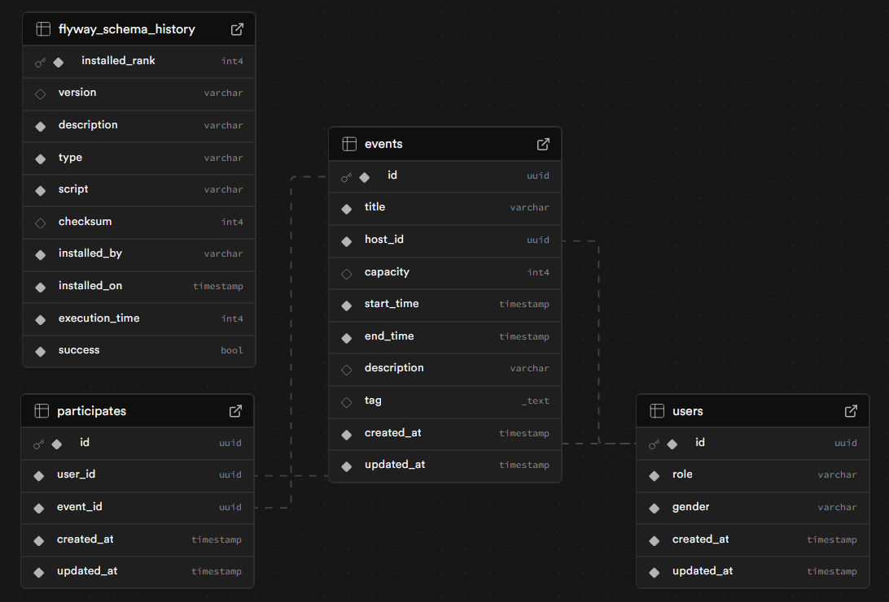
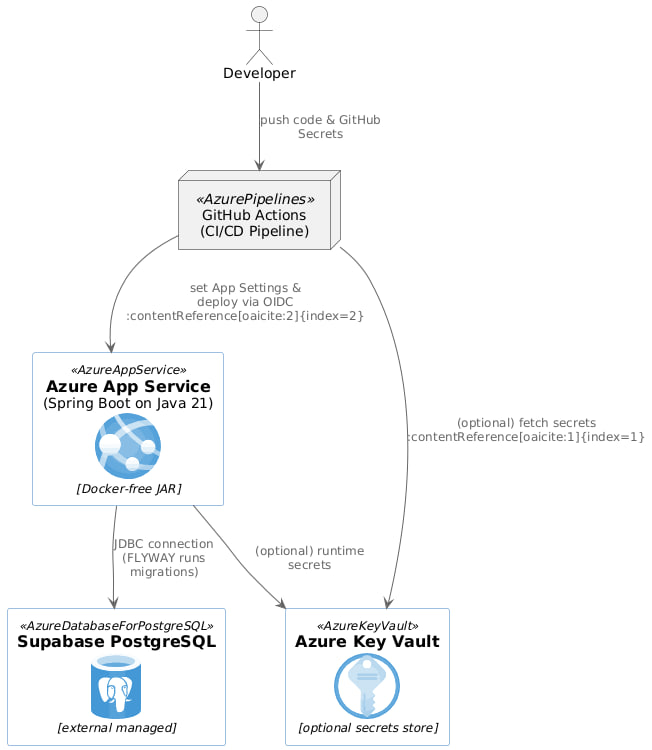

# SummerBuild: Event Management System

Our Website is hosted on https://summerbuild.pages.dev/login

## Pain points it solves

- Have you ever discovered an interesting event in Outlook only to find that registration has already closed? Our app solves this problem by providing proactive event management and timely notifications.

## External API used

- Gemini API key --> used for classifying events on web scraper

## Functional Requirements

### Students

#### Authentication & Authorization
- FR1.1: Support login via Supabase OAuth.
- FR1.2: Redirect logged-in students to the home calendar view.

#### Event Discovery
- FR1.3: Display a list of all available events.
- FR1.4: Support filtering events (by date, type, availability, etc.).
- FR1.5: Allow users to view detailed event info by clicking on an event (GET `/events/:id`).

#### Event Registration
- FR1.6: Allow students to register for an event via a register button.
- FR1.7: On registration:
  - Check if the user is already registered.
  - Check if the event is still open.
  - Check for scheduling collisions with other registered events.
  - Decrease available slots by 1 if valid.
  - Optionally, send confirmation email.
  - Mark event on user calendar.

#### Event Cancellation
- FR1.8: Allow students to cancel registration.
- FR1.9: On cancellation:
  - Check if user is registered.
  - Check if event is not in the past or cancelled.
  - Remove user registration.
  - Increase available slots by 1.

#### Home Page Calendar
- FR1.10: Load student’s registered events on a calendar view.
- FR1.11: Allow exporting registered events as `.ics` calendar file.

---

### Admin

#### Authentication & Authorization
- FR2.1: Login via Supabase OAuth and redirect to admin dashboard.

#### Event Listing Management
- FR2.2: View all event listings.
- FR2.3: Mark event listings as ‘non-viewable’ (soft delete/ghost).

#### User Management
- FR2.4: Select an event and view its registered users.
- FR2.5: Remove a user from an event manually with confirmation.
- FR2.6: Automatically update available slots on user removal.

#### Data Export
- FR2.7: Export list of users registered for an event as a downloadable CSV.

---

### Organisers/Clubs

#### Authentication & Authorization
- FR3.1: Login via Supabase OAuth and redirect to organiser dashboard.

#### Registration Stats
- FR3.2: View user registration list for a specific event.

#### Data Export
- FR3.3: Export registration list for an event as a downloadable CSV.

---

## Non-Functional Requirements

### Security
- NFR1: Enforce OAuth-based secure login and role-based access control (RBAC).
- NFR2: All sensitive operations must require authentication and authorization.

### Performance & Scalability
- NFR3: Event listing and filtering must return within 300ms for a typical request.
- NFR4: Calendar loading and ICS export must scale to support 1000+ events per user.
- NFR5: System should handle concurrent event registrations and prevent race conditions.

### Availability & Reliability
- NFR6: Ensure high availability of critical endpoints (login, register, cancel).
- NFR7: Use Supabase’s real-time features or database triggers to keep user calendars in sync.
- NFR8: System should gracefully handle failure cases (e.g., email server down, database connection issues).

### Usability & UX
- NFR9: All user interactions should have immediate feedback (e.g., spinners, success/failure toasts).
- NFR10: Calendar UI should support responsive design and work across browsers.

### Maintainability & Observability
- NFR11: Use structured logging and tracing for all critical user actions.
- NFR12: Support feature toggles for optional features like confirmation emails.

### Export Features
- NFR13: Exported files (CSV, ICS) must adhere to proper standards and encoding (UTF-8).
- NFR14: File exports should auto-trigger download with proper naming conventions.

## Assumptions
- Amount of users able to support 70-80% of NTU population

# C3 Diagram

## Context diagram


## Container diagram


## Component diagram


## Database diagram


# Deployment plan
## Frontend
- Deployed on cloudflare pages

## backend

- backend is deployed using a CICD pipeline found in .github/workflows




# dev guide

## Prerequisites
- **Docker Desktop** installed and running
- **Visual Studio Code** with the **Dev Containers** extension
- **Git** for cloning the repository

## Quick Start

### 1. Clone the Repository
```bash
git clone https://github.com/jackOfNoTradess/SummerBuild
cd SummerBuild
```

### 2. Open in Dev Container
1. Open VS Code in the project directory:
   ```bash
   code .
   ```
2. When prompted, click **"Reopen in Container"** or:
   - Press `Ctrl+Shift+P` (Windows/Linux) or `Cmd+Shift+P` (Mac)
   - Type "Dev Containers: Reopen in Container"
   - Select the option and wait for the container to build

### 3. Verify Dev Container Setup
Once the container is running, verify the environment:
```bash
java -version
mvn -version
node --version
docker --version
```
### 4. Database setup
1. **Initialize Supabase:**
   ```bash
   supabase init
   ```

2. **Start Supabase locally:**
   ```bash
   supabase start
   ```

3. **Configure database connection in `application.properties`:**
    - check after you run supabase start
   ```properties
   spring.datasource.url=jdbc:postgresql://localhost:54321/summerbuild
   spring.datasource.username=your_username
   spring.datasource.password=your_password
   ```

4. **Run Flyway migrations:**
   ```bash
   cd Backend
   mvn flyway:migrate
   ```

## running application

### backend
```bash
cd backend
mvn clean install
mvn spring-boot:run
```

### frontend
```bash
cd frontend
npm install
npm run dev
```

## api docs
http://localhost:8080/swagger-ui/index.html#/

## Flyway CLI Commands
```bash
mvn flyway:migrate    # Run migrations
mvn flyway:info       # Show migration status
mvn flyway:clean      # Drop all objects
```

## 🛠 Flyway Migration Usage Guide
### 🚀 `mvn flyway:migrate`

**Purpose:**  
Applies all pending migration scripts to the database.

**When to use:**
- After adding a new migration SQL file
- When syncing your local DB schema with the latest version
- On application startup (if auto-run is configured in Spring Boot)

**Command:**
```bash
mvn flyway:migrate

```

### ⚠️ `mvn flyway:clean` — Use with Caution

**Purpose:**  
This command **drops all database objects** (tables, views, constraints, etc.) in the configured schema. It resets the entire schema.

---

**🕵️‍♂️ When to Use**

Only use `flyway:clean` in **development or testing environments**:

- To **wipe** the database and start from scratch
- When schema changes or migrations are broken and unrecoverable
- Before re-running a full migration set for a clean slate


## 🐘 Supabase Local Development Migration Guide
### 📝 Creating Migrations
1. **Create a new migration:**
```bash
supabase migration new <migration_name>
```


2. **Edit the generated SQL file in `supabase/migrations/`:**
- Do this only to amend bucket policies. ALL postgres migrations use flyway
```sql
-- Example: 20240606000001_create_users_table.sql
CREATE TABLE users (
    id UUID DEFAULT gen_random_uuid() PRIMARY KEY,
    email VARCHAR(255) UNIQUE NOT NULL,
    created_at TIMESTAMP WITH TIME ZONE DEFAULT NOW()
);
```

### 🔄 Running Migrations

1. **Apply migrations to local database:**
```bash
supabase db push --local
```

2. **Reseting Supabase**
```bash
supabase reset
```
